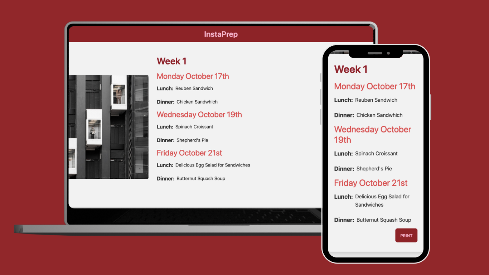

# IntaPrep

A mealprep app that minimizes the time you spend planning out your meals for the week. Load recipes in your cookbook, and with the click of a button, InstaPrep will list the meals you'll be eating for any specific day

## How It's Made

**Tech:** bcrypt, connect-mongo, dotenv, ejs, express, express-flash, express-session, mongodb, mongoose, morgan, nodemon, passport, passport-local, validator

Recipes are added to the database using a form that handles a POST request. These recipes are created on the form, sent to the MongoDB database and retrieved and displayed to the user on their profile using EJS. Recipes can be favorited using an update method.

Meal plans are created using a form in which the user selects the type of meal, the days they will be cooking and start/end date of the meal plan. From this data, recipes are randomized and displayed to the user

Users are authenticated using PassportJS so anyone can have their own account. Passwords are hashed using bcrypt to protect user privacy.

## Optimizations

Core functionality on the app is completed. As per requests from friends and family, I will be implementing these features in the future:

- Adding greater personalization to the meals such as: type of cuisine, nutritional information
- ability to add meals by copying and pasting a URL
- formatting the HTML so that printing a page will render data with a clean UI

## Lessons Learned

While building this app, I've learned that it's important to keep track of IDs that exist between the various models of the app. If proper links are not established with the methods, the server will not return anything.

Additionally, EJS may throw errors if data contains undefined elements. It's best to render entire objects within EJS and parse through properties as necessary.

I've also learned how to use moment to display dates correctly as well as retrieve certain days between 2 parameters.

## Check Out My Other Work

[Pomodoro Task Tracker](https://github.com/jonathanmani/Pomodoro-Task-Tracker) - Create tasks, set your priority and record pomodoro sessions with this all-in-one task tracker

[DailyUI](https://github.com/jonathanmani/DailyUI) - A collection of Front End designs made using TailwindCss and React

[CodeWars](https://github.com/jonathanmani/CodeWars) - A collection of all the CodeWars problems I've done to practice my knowledge in Javascript.
